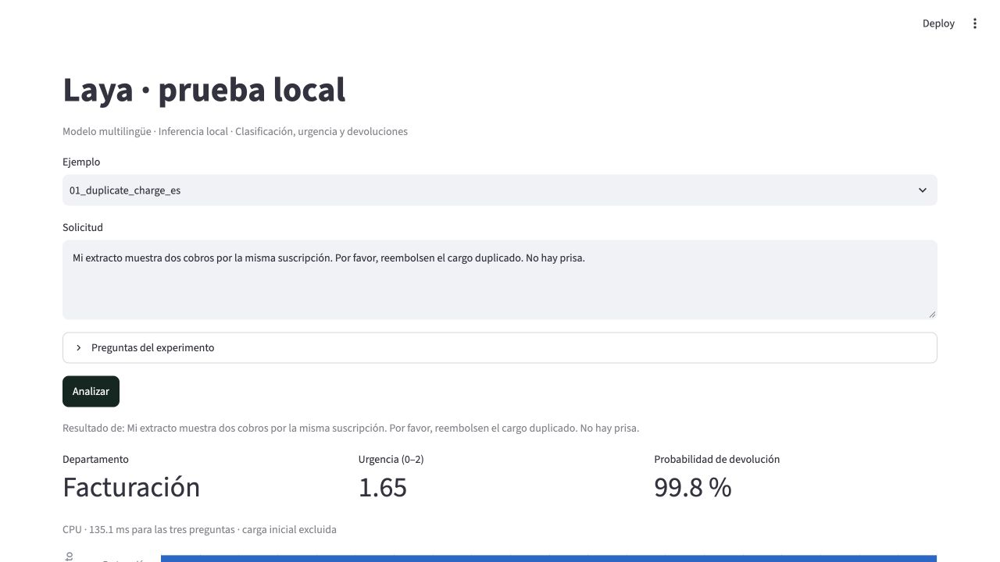

# Laya local lab

Una prueba reproducible de [Laya](https://github.com/NandhaKishorM/laya) en un Mac M1 Max: clasificar solicitudes, puntuar urgencia y detectar peticiones de devolución. Todo el texto es sintético; la inferencia se ejecuta localmente.

**Resultado:** 18/30 clasificaciones correctas. La GPU redujo la mediana de 126 a 33 ms por solicitud, pero no corrigió los errores semánticos. [Resultados y límites](RESULTADOS.md).

## Reproducir

Requisitos: [uv](https://docs.astral.sh/uv/getting-started/installation/), Python 3.12 y acceso a Internet para la primera instalación/descarga. Probado en macOS con M1 Max y 32 GB. El checkpoint ocupa unos 678 MB, además de dependencias y cachés. No hace falta una clave de API.

```sh
git clone https://github.com/torresnicolas0/laya-local-lab.git
cd laya-local-lab
export UV_CACHE_DIR="$PWD/.cache/uv"
uv sync --frozen --python 3.12
.venv/bin/python lab.py prepare

HF_HUB_OFFLINE=1 TRANSFORMERS_OFFLINE=1 \
  .venv/bin/python lab.py evaluate --device cpu --output results/my-cpu.json
```

`uv.lock` fija las dependencias y `model.lock.json` la revisión exacta del modelo. El programa descarga únicamente el checkpoint multilingüe. Rechaza entradas que exceden el contexto y se niega a sobrescribir resultados existentes.

En un Mac compatible, repetir **después de terminar CPU**:

```sh
HF_HUB_OFFLINE=1 TRANSFORMERS_OFFLINE=1 \
  .venv/bin/python lab.py evaluate --device mps --output results/my-mps.json
```

Si MPS no está disponible, usar CPU. En esta prueba Codex necesitó permiso para acceder a la GPU y abrir el puerto local; eso corresponde al aislamiento de la herramienta.

## Probar en el navegador

```sh
HF_HUB_OFFLINE=1 TRANSFORMERS_OFFLINE=1 \
  .venv/bin/python -m streamlit run app.py
```

Abrir [127.0.0.1:8501](http://127.0.0.1:8501). Elegir un ejemplo, editarlo y pulsar **Analizar**. La interfaz usa CPU, muestra las respuestas originales y permite descargarlas. Los cambios interactivos no modifican el conjunto de evaluación. Escucha solo en localhost y tiene la telemetría de Streamlit desactivada.



## Comprobaciones

```sh
HF_HUB_OFFLINE=1 TRANSFORMERS_OFFLINE=1 .venv/bin/python -m unittest -v

# Entorno nuevo, reutilizando paquetes y modelo ya descargados:
UV_PROJECT_ENVIRONMENT=.venv-repro uv sync --frozen --offline --python 3.12

# macOS: bloquear la red para el proceso y comprobar IPv4 e IPv6.
HF_HUB_OFFLINE=1 TRANSFORMERS_OFFLINE=1 \
  sandbox-exec -p '(version 1) (allow default) (deny network*)' \
  .venv-repro/bin/python lab.py evaluate --device cpu --verify-offline \
  --output results/my-offline.json
```

Los cuatro tests comprueban entradas, límites, contrato real del modelo y cálculos con valores conocidos. No exigen que el modelo acierte: eso se mide por separado.

## Qué contiene

- `cases.json`: diez situaciones traducidas a tres idiomas, con etiquetas esperadas.
- `questions.json`: preguntas y rúbrica fijas, en inglés.
- `lab.py`: descarga y evaluación; `app.py`: demostración mínima.
- `results/`: respuestas originales, métricas, entorno, hashes y verificación.
- `RESULTADOS.md`: método, cifras y errores relevantes para contar la experiencia.

El modelo y el SDK son proyectos de ConvAI, con licencia Apache-2.0. Este repositorio no incluye sus pesos. No se utilizaron correos, clientes ni datos privados.
