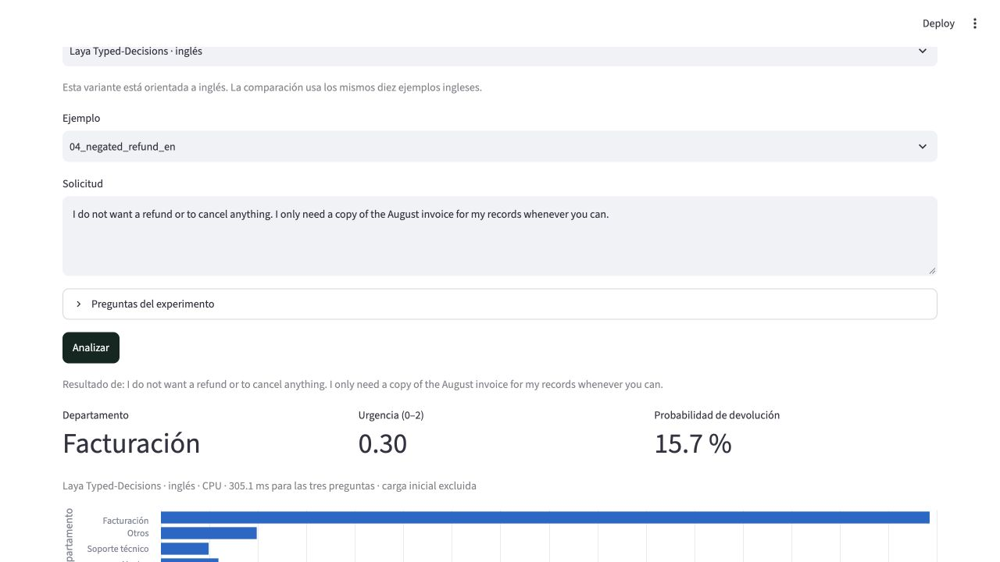

# Laya local lab

Una prueba reproducible de tres variantes de [Laya](https://github.com/NandhaKishorM/laya) en un Mac M1 Max: soporte, guardrails, filtro RAG y selección de modelo. Todo el texto es sintético; la inferencia se ejecuta localmente.

**Comparación en inglés:** Multilingual acertó 6/10 departamentos, Laya base 9/10 y Typed-Decisions 10/10. Son diez ejemplos exploratorios. [Comparación y límites](COMPARACION.md).

**Tres escenarios nuevos:** Typed-Decisions obtuvo 10/12 en guardrails, 9/12 en RAG y 8/12 en selección, pero falló las cuatro peticiones que necesitaban herramientas. [Método, errores y receta](ESCENARIOS.md). El 10/10 en soporte no se generalizó.

La [prueba inicial ES/PT/EN](RESULTADOS.md) se conserva: Multilingual obtuvo 18/30 clasificaciones correctas. Sus archivos y hashes corresponden al [commit inicial](https://github.com/torresnicolas0/laya-local-lab/tree/22024e4d79e730e27c3658e065f71d7fb734cbb8).

## Reproducir

Requisitos: [uv](https://docs.astral.sh/uv/getting-started/installation/), Python 3.12 y acceso a Internet para la primera instalación/descarga. Probado en macOS con M1 Max y 32 GB. El checkpoint ocupa unos 678 MB, además de dependencias y cachés. No hace falta una clave de API.

```sh
git clone https://github.com/torresnicolas0/laya-local-lab.git
cd laya-local-lab
export UV_CACHE_DIR="$PWD/.cache/uv"
uv sync --frozen --python 3.12
.venv/bin/python lab.py prepare

HF_HUB_OFFLINE=1 TRANSFORMERS_OFFLINE=1 \
  .venv/bin/python lab.py evaluate --device cpu --output results/my-cpu.json
```

`uv.lock` fija las dependencias y `models.lock.json` las revisiones de los tres modelos. Sin opciones, se descarga y evalúa únicamente Multilingual; `model.lock.json` conserva el registro original. El programa rechaza entradas demasiado largas y no sobrescribe resultados existentes.

En un Mac compatible, repetir **después de terminar CPU**:

```sh
HF_HUB_OFFLINE=1 TRANSFORMERS_OFFLINE=1 \
  .venv/bin/python lab.py evaluate --device mps --output results/my-mps.json
```

Si MPS no está disponible, usar CPU. En esta prueba Codex necesitó permiso para acceder a la GPU y abrir el puerto local; eso corresponde al aislamiento de la herramienta.

## Comparar las tres variantes

```sh
.venv/bin/python lab.py prepare --model all
HF_HUB_OFFLINE=1 TRANSFORMERS_OFFLINE=1 \
  .venv/bin/python lab.py compare --device cpu --output-dir results/my-comparison-cpu
HF_HUB_OFFLINE=1 TRANSFORMERS_OFFLINE=1 \
  .venv/bin/python lab.py compare --device mps --output-dir results/my-comparison-mps
```

Los modelos corren secuencialmente en procesos separados, sobre los mismos diez textos ingleses. Se guardan respuestas individuales y `summary.json`. La descarga adicional es de unos 840 MB por cada variante inglesa. Para evaluar una sola: `evaluate --model typed-decisions --language en --device cpu --output results/my-typed.json` después de `lab.py`.

## Probar en el navegador

```sh
HF_HUB_OFFLINE=1 TRANSFORMERS_OFFLINE=1 \
  .venv/bin/python -m streamlit run app.py
```

Abrir [127.0.0.1:8501](http://127.0.0.1:8501). Elegir modelo, experimento y ejemplo, editarlo y pulsar **Analizar**. La interfaz usa CPU y permite descargar las respuestas originales. Los tres escenarios nuevos usan inglés; la selección de modelo muestra una propuesta sin llamar a proveedores. Los cambios interactivos no modifican la evaluación. Escucha solo en localhost y tiene la telemetría desactivada.



## Comprobaciones

```sh
.venv/bin/python lab.py prepare --model all
HF_HUB_OFFLINE=1 TRANSFORMERS_OFFLINE=1 .venv/bin/python -m unittest -v

# Entorno nuevo, reutilizando paquetes y modelo ya descargados:
UV_PROJECT_ENVIRONMENT=.venv-repro uv sync --frozen --offline --python 3.12

# macOS: bloquear la red para el proceso y comprobar IPv4 e IPv6.
HF_HUB_OFFLINE=1 TRANSFORMERS_OFFLINE=1 \
  sandbox-exec -p '(version 1) (allow default) (deny network*)' \
  .venv-repro/bin/python lab.py evaluate --device cpu --verify-offline \
  --output results/my-offline.json
```

Para repetir las tres variantes sin red, sustituir `evaluate ...` por `compare --device cpu --verify-offline --output-dir results/my-comparison-offline` en el comando anterior. Los seis tests originales comprueban entradas, límites, contrato real, cálculos, selección de idioma y revisión de modelos; la precisión se mide por separado.

Para los nuevos escenarios, usar `workflows.py compare --device cpu --verify-offline --output-dir results/my-workflows-offline` dentro del mismo sandbox. Cinco tests añadidos comprueban protocolo, reglas, métricas e interacción real. Pasaron los once tests.

## Qué contiene

- `cases.json`: diez situaciones traducidas a tres idiomas, con etiquetas esperadas.
- `questions.json`: preguntas y rúbrica fijas, en inglés.
- `lab.py`: descarga y evaluación; `app.py`: demostración mínima.
- `workflows.py`, `workflows.json`, `workflow_cases.json`: tres escenarios con protocolo fijado antes de ejecutar.
- `results/`: respuestas originales, métricas, entorno, hashes y verificación.
- `RESULTADOS.md`: prueba inicial; `COMPARACION.md`: variantes en soporte; `ESCENARIOS.md`: usos adicionales y sus límites.

El modelo y el SDK son proyectos de ConvAI, con licencia Apache-2.0. Este repositorio no incluye sus pesos. No se utilizaron correos, clientes ni datos privados.
